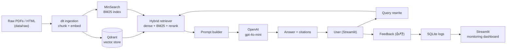
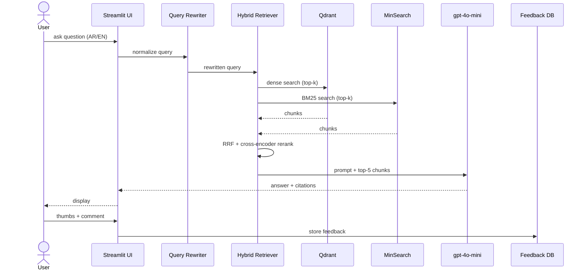
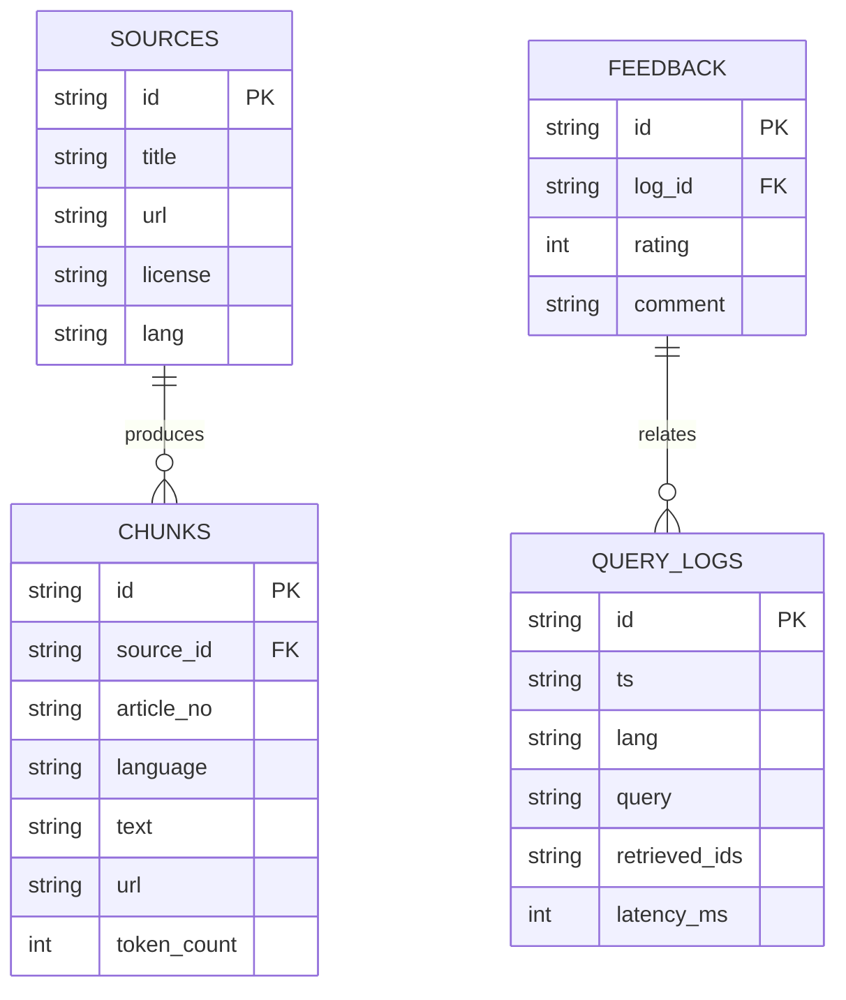

## Plan: HRAI – Saudi Labour Law Assistant

A focused RAG application that ingests the official Saudi Labour Law (Royal Decree M/51), HR regulations, employee-rights articles, and supporting Ministry of Human Resources & Social Development documents, then lets users ask plain-language questions and receive citation-backed answers in English/Arabic. Aligns to the DataTalks.Club LLM Zoomcamp evaluation rubric.

### Naming

- **Project title**: `HRAI – Saudi Labour Law Assistant`
- **Repo name suggestion**: `hrai-saudi-labour-law-assistant`
- **Tagline**: *An AI copilot for Saudi Labour Law, HR policy, and employee rights.*

**Steps**

1. **Scope & dataset curation** (parallel with step 2)
   - Sources: Saudi Labour Law (M/51, Arabic + English translation), Executive Regulations, MHRSD decisions/circulars, Nitaqat/GOSI explainer articles, GOSI FAQ pages, and curated employee-rights blog posts (with permission).
   - Save raw PDFs/HTML under `data/raw/`; track source URL/license in `data/sources.csv`.

2. **Project scaffold**
   - Create folders: `data/raw/`, `data/processed/`, `ingest/`, `retrieval/`, `app/`, `eval/`, `monitoring/`, `docker/`, `notebooks/`.
   - Add `pyproject.toml` or `requirements.txt` pinning `openai`, `qdrant-client`, `dlt[filesystem,qdrant]`, `streamlit`, `fastapi` (for optional API), `minsearch` (baseline), `pandas`, `pypdf`, `beautifulsoup4`.
   - Add `.env.example` with `OPENAI_API_KEY`, `QDRANT_HOST`, `QDRANT_PORT`.
   - Initialize git, `.gitignore` (exclude `data/raw/*.pdf` if too large, `.env`), and a dedicated GitHub repo `hrai-saudi-labour-law-assistant`.

3. **Automated ingestion with dlt** *(parallel with step 4)*
   - `ingest/load_law.py`: dlt pipeline `@dlt.resource` reads `data/raw/` (PDF → `pypdf`; HTML → `bs4`), normalizes to `(source_id, article_no, language, text, url)`.
   - dlt destination: `dlt.destinations.qdrant(qdrant_location="http://qdrant:6333")`, embeddings via `openai.text-embedding-3-small` (batch size 64).
   - `ingest/run_pipeline.py` orchestrates: extract → chunk (article-aware, 800 tokens, 100 overlap) → embed → load.
   - Schedule/CLI entrypoint: `python ingest/run_pipeline.py --reset`.

4. **Retrieval layer (hybrid, evaluated)**
   - Implement three retrievers and evaluate in step 7:
     - `retrieval/text_search.py` → MinSearch (BM25 baseline) over the same chunks.
     - `retrieval/vector_search.py` → Qdrant dense cosine search.
     - `retrieval/hybrid.py` → RRF fusion of BM25 + dense, optional `cross-encoder/ms-marco-MiniLM` rerank.
   - `retrieval/rewrite.py` → optional LLM query-rewriter for Arabic↔English normalization.

5. **LLM answer generation**
   - `app/rag.py`: prompt template with system rules (cite article numbers, refuse when context insufficient, answer in user's language), top-k=5 chunks, gpt-4o-mini, temperature 0.2.
   - Return `{answer, citations: [{source_id, article_no, url}], context_chunks}`.

6. **Streamlit interface**
   - `app/Home.py`: chat UI, language toggle (AR/EN), sidebar with example questions ("How many days of annual leave am I entitled to?", "What is the notice period during probation?").
   - `app/pages/1_Feedback.py`: 👍/👎 + free-text; persists to `monitoring/feedback.db` (SQLite).
   - `app/pages/2_Dashboard.py`: Streamlit-native dashboard (≥5 charts) – daily volume, latency p50/p95, retrieval hit-rate, top sources, language mix – backed by the feedback/log DB.

7. **Evaluation (LLM Zoomcamp rubric)**
   - `eval/generate_golden.py`: hand-curate 40+ Q&A pairs across topics (leave, EOSB/gratuity, probation, termination, GOSI, WPS, Nitaqat, female-worker rights, remote work).
   - `eval/retrieval_eval.py`: hit-rate + MRR for BM25, dense, hybrid, hybrid+rerank → keep best.
   - `eval/llm_eval.py`: LLM-as-judge (gpt-4o-mini) scoring relevance, faithfulness, citation accuracy across ≥3 prompt variants → keep best.
   - Save metrics to `eval/results.json` and chart in README.

8. **Containerization & reproducibility**
   - `docker/Dockerfile` for the Streamlit app; `docker-compose.yml` with services: `qdrant`, `app`, `ingest` (one-shot).
   - Pin versions in `requirements.txt`; README "How to run" covers `docker compose up`, ingestion, and evaluation steps.

9. **Monitoring & feedback loop**
   - Log every query: `{ts, lang, query, retrieved_ids, latency_ms, feedback}` to `monitoring/logs.db`.
   - Dashboard charts (Streamlit): 1) volume/day, 2) avg latency, 3) thumbs-up rate, 4) top sources cited, 5) language split, 6) unanswered rate.
   - Optional cloud deploy: render.com or fly.io (counts toward bonus points).

10. **Documentation**
    - `README.md`: problem, data sources, architecture diagram, screenshots, evaluation results, run instructions, ethics note (not legal advice).
    - `setup.md`, `usage.md`, `contributing.md` split as needed.
    - 60-second screen-capture of Streamlit app for the README.

**Relevant files**
- `ingest/load_law.py`, `ingest/run_pipeline.py` — dlt pipeline to Qdrant.
- `retrieval/text_search.py`, `retrieval/vector_search.py`, `retrieval/hybrid.py`, `retrieval/rewrite.py` — retrievers.
- `app/rag.py`, `app/Home.py`, `app/pages/1_Feedback.py`, `app/pages/2_Dashboard.py` — UI + monitoring.
- `eval/generate_golden.py`, `eval/retrieval_eval.py`, `eval/llm_eval.py`, `eval/results.json` — evaluation.
- `monitoring/feedback.db`, `monitoring/logs.db` — user feedback & logs.
- `docker/Dockerfile`, `docker-compose.yml` — containerization.
- `README.md`, `setup.md`, `usage.md` — documentation.
- `.env.example`, `requirements.txt`, `data/sources.csv` — config & data lineage.

**Diagrams**

**Verification**

1. `docker compose up qdrant` → Qdrant health check on `:6333` returns green.
2. `python ingest/run_pipeline.py --reset` → counts in Qdrant match `data/sources.csv` row counts; sample nearest-neighbor sanity check returns matching article.
3. `python eval/retrieval_eval.py` → hit-rate ≥0.80, MRR ≥0.65 for the chosen retriever; results saved to `eval/results.json`.
4. `python eval/llm_eval.py` → faithfulness ≥0.90, citation accuracy ≥0.85 on the golden set; ≥3 prompt variants compared.
5. `streamlit run app/Home.py` → AR/EN Q&A round-trip; feedback persists; dashboard renders ≥5 charts with non-empty data.
6. `docker compose up` (full stack) → app reachable on `:8501`, ingestion job exits 0 on a fresh volume.
7. README walkthrough reproduces steps 1–6 from a clean clone.
