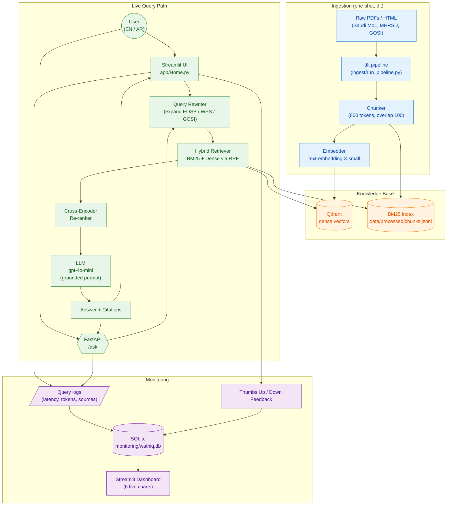

# Wathiq HR — Saudi Labour Law Assistant

> **Wathiq HR** (وثيق) is an AI copilot for Saudi Labour Law, HR policy, and employee rights.
> "Wathiq" means *trustworthy* in Arabic — the assistant grounds every answer in official
> sources and cites the supporting article when available.

[](https://www.python.org/)
[](https://www.docker.com/)
[](./LICENSE)
[](#architecture)
[](#features)

An end-to-end **Retrieval-Augmented Generation (RAG)** application that answers
plain-language questions about the Saudi Labour Law (Royal Decree M/51), HR
regulations, and employee rights. Built as the capstone project for the
**DataTalks.Club LLM Zoomcamp** and aligned to the course evaluation rubric
(problem definition, hybrid retrieval, LLM evaluation, UI, automated ingestion,
monitoring, containerization, reproducibility, best practices).

---

## Table of Contents

- [Why Wathiq HR?](#why-wathiq-hr)
- [Features](#features)
- [Dataset](#dataset)
- [Architecture](#architecture)
- [Project Structure](#project-structure)
- [Tech Stack](#tech-stack)
- [Quick Start](#quick-start)
- [Usage](#usage)
- [Evaluation (LLM Zoomcamp Rubric)](#evaluation-llm-zoomcamp-rubric)
- [Monitoring & Feedback](#monitoring--feedback)
- [Roadmap](#roadmap)
- [Disclaimer](#disclaimer)
- [Contributing](#contributing)
- [License](#license)

---

## Why Wathiq HR?

Saudi employees, HR teams, and legal advisors routinely need answers to
questions like:

- *"How is end-of-service benefit (EOSB) calculated after 5 years?"*
- *"How many days of annual leave am I entitled to under Article 109?"*
- *"What does the Wage Protection System (WPS) require from employers?"*
- *"How are Nitaqat bands calculated for my company?"*

The authoritative answer lives in the official **Saudi Labour Law**, the
**MHRSD Executive Regulations**, and various portals — often in Arabic,
scattered across PDFs and government websites.

A general-purpose LLM can confidently hallucinate article numbers. **Wathiq HR**
solves this with a RAG pipeline that:

1. **Retrieves** the relevant articles from the indexed law sources,
2. **Forces** the LLM to ground its answer in those passages,
3. **Refuses** to guess when the retrieved context is missing,
4. **Cites** the source article and URL with every answer.

The result is a trustworthy, citation-backed assistant for everyday HR and
labour-law questions.

---

## Features

- **Bilingual chat** — full support for English and Arabic (العربية)
- **Hybrid retrieval** — BM25 + dense embeddings combined via Reciprocal-Rank Fusion (RRF)
- **Cross-encoder re-ranking** — top passages re-scored for precision
- **Query rewriting** — expands Saudi-HR abbreviations (EOSB, WPS, GOSI, Nitaqat, …)
- **Citation-backed answers** — every response links to the source article
- **Streamlit UI** with thumbs-up / thumbs-down feedback widgets and example questions
- **SQLite-backed monitoring dashboard** with 6 live charts
  (volume, latency, language split, feedback ratio, top sources, unanswered rate)
- **FastAPI endpoint** at `/ask` for programmatic access
- **One-shot ingestion** via [`dlt`](https://dlthub.com/) straight into Qdrant
- **Fully containerized** with `docker-compose` (qdrant + ingest + app + api)

---

## Dataset

All sources are public Saudi government / ILO documents. See
[`data/sources.csv`](./data/sources.csv) for the full list with URLs, language,
and license. The corpus covers the most-asked Saudi HR topics:

| Source ID        | Title                                              | Lang |
| ---------------- | -------------------------------------------------- | :--: |
| `m51_en`         | Saudi Labour Law (M/51) — Consolidated Reference   |  en  |
| `m51_ar`         | نظام العمل — Consolidated Reference                |  ar  |
| `exec_reg_ar`    | Executive Regulations — Reference Summary         |  ar  |
| `gosi_faq_en`    | GOSI FAQ                                           |  en  |
| `wps_en`         | Wage Protection System                             |  en  |
| `nitaqat_en`     | Nitaqat Bands                                      |  en  |
| `female_workers_en` | Women in the Workplace                          |  en  |
| `remote_work_ar` | Remote Work Guide                                  |  ar  |

---

## Architecture

Wathiq HR follows a classic RAG pipeline: **ingestion** populates a hybrid
vector + lexical store, **retrieval** finds the most relevant passages, and an
LLM **generates** a grounded, cited answer.

### High-Level Flow



### Component Responsibilities

| Layer            | Component             | Responsibility                                               |
| ---------------- | --------------------- | ------------------------------------------------------------ |
| **Ingestion**    | `dlt` pipeline        | Download → parse → chunk → embed → write to Qdrant + BM25    |
| **Storage**      | Qdrant                | Dense vector search (`cosine`)                               |
|                  | BM25 JSONL            | Lexical / keyword search                                     |
| **Retrieval**    | Hybrid + RRF          | Combine BM25 + dense results with Reciprocal-Rank Fusion     |
|                  | Cross-Encoder         | Re-rank top passages for precision                           |
| **Generation**   | OpenAI `gpt-4o-mini`  | Produce answer grounded in retrieved passages                |
| **UI**           | Streamlit             | Chat page, feedback widgets, dashboard page                  |
| **API**          | FastAPI `/ask`        | Programmatic JSON access                                     |
| **Monitoring**   | SQLite + Altair       | Latency, volume, language split, feedback, top sources       |

---

## Project Structure

```text
wathiq-hr/
├── app/                  # Streamlit UI + FastAPI
│   ├── Home.py           # Chat entry point
│   ├── rag.py            # RAG pipeline (rewrite → retrieve → generate)
│   ├── api.py            # FastAPI /ask endpoint
│   └── pages/            # Dashboard, Feedback, etc.
├── ingest/               # dlt ingestion pipeline
│   ├── download_sources.py
│   ├── chunker.py
│   └── run_pipeline.py
├── retrieval/            # Hybrid search + reranking
│   ├── hybrid.py
│   ├── rerank.py
│   ├── rewrite.py
│   ├── store.py          # Qdrant wrapper
│   ├── text_search.py    # BM25
│   └── vector_search.py
├── eval/                 # LLM Zoomcamp evaluations
│   ├── generate_golden.py
│   ├── retrieval_eval.py
│   ├── llm_eval.py
│   └── run_all.py
├── data/
│   ├── sources.csv       # Source registry
│   ├── raw/              # Raw documents
│   └── processed/        # BM25 chunks
├── monitoring/           # SQLite logs + dashboard assets
├── docker/               # Dockerfile
├── docker-compose.yml    # qdrant + ingest + app + api
├── requirements.txt      # Pinned dependencies (Python 3.11)
├── setup.md              # Detailed install guide
├── usage.md              # Day-to-day commands
└── project-guidelines.md # DataTalks.Club rubric notes
```

---

## Tech Stack

| Layer            | Tool                                                       |
| ---------------- | ---------------------------------------------------------- |
| LLM + Embeddings | `openai` · `gpt-4o-mini` · `text-embedding-3-small`        |
| Vector DB        | **Qdrant** (`qdrant/qdrant:v1.12.0`)                       |
| Lexical Search   | **BM25** via `minsearch` + JSONL index                     |
| Re-ranker        | **fastembed** cross-encoder (CPU-friendly)                 |
| Ingestion        | **dlt** (`dlt[filesystem,parquet]`)                        |
| UI               | **Streamlit**                                              |
| API              | **FastAPI** + **uvicorn**                                  |
| Monitoring       | **SQLite** + **Altair** charts                             |
| Containerization | **Docker** / **Docker Compose**                            |
| Language         | Python **3.11**                                            |

---

## Quick Start

The fastest way is via Docker (Qdrant + app in one command):

```bash
# 1. Clone the repo
git clone https://github.com/<you>/wathiq-hr.git
cd wathiq-hr

# 2. Configure secrets
cp .env.example .env
# edit .env and set OPENAI_API_KEY=sk-...

# 3. Start Qdrant + Streamlit
docker compose up -d qdrant app

# 4. Run the one-shot ingestion
docker compose --profile ingest run --rm ingest
```

Open the chat UI at <http://localhost:8501> and the monitoring dashboard at
<http://localhost:8501/Dashboard>.

For a local (non-Docker) install, see [`setup.md`](./setup.md).

---

## Usage

### Streamlit Chat

```bash
streamlit run app/Home.py
```

Then open <http://localhost:8501>.

- **Sidebar**: pick language (English / العربية), tune `top_k`, toggle the
  reranker and the query rewriter.
- **Example questions**: click any preset to pre-fill the input box.
- **Feedback**: every answer has thumbs-up / thumbs-down buttons; free-text
  comments live on the **Feedback** page.
- **Dashboard**: navigate to the **Dashboard** page for 6 live charts.

### FastAPI

```bash
uvicorn app.api:app --host 0.0.0.0 --port 8000 --reload
```

```bash
curl -X POST http://localhost:8000/ask \
  -H 'content-type: application/json' \
  -d '{"query": "How many days of annual leave am I entitled to?", "language": "en"}'
```

Response shape:

```json
{
  "answer": "Under the Saudi Labour Law, you are entitled to ...",
  "citations": [
    { "source_id": "m51_en", "article_no": "109", "url": "...", "text": "..." }
  ],
  "latency_ms": 845,
  "language": "en"
}
```

### Re-Ingesting the Knowledge Base

```bash
# Full re-ingest (drops the Qdrant collection first)
python ingest/run_pipeline.py --reset

# Smoke test on the first 200 chunks
python ingest/run_pipeline.py --reset --limit 200
```

See [`usage.md`](./usage.md) for the full command reference.

---


## Monitoring & Feedback

Every interaction is logged to a local SQLite database so the team can
observe quality over time.

- **Queries** → `monitoring/wathiq.db` · table `query_logs`
  (timestamp, query, language, latency, retrieved sources, tokens, answer)
- **Feedback** → table `feedback` (thumbs-up / thumbs-down + free-text comments)
- **Dashboard** → 6 live charts at `/Dashboard`:
  1. Query volume over time
  2. Latency distribution (p50 / p95)
  3. Language split (EN vs AR)
  4. Positive / negative feedback ratio
  5. Top retrieved sources
  6. Unanswered / refused rate

Delete `monitoring/wathiq.db` to reset all metrics.

---

## Roadmap

- [ ] Cloud deployment guide (Render / Fly.io / Hugging Face Spaces)
- [ ] Stricter guardrails with article-number validation
- [ ] Expanded sources (labour court rulings, MHRSD circulars)
- [ ] Multilingual embedding alignment for Arabic ↔ English queries
- [ ] Evaluation harness via CI (GitHub Actions)

---

## Disclaimer

**Wathiq HR provides general information, not legal advice.** Always confirm
specific cases with a qualified Saudi lawyer or the MHRSD.

---

## Contributing

Issues and pull requests are welcome. For larger changes, please open an
issue first to discuss the approach. See [`project-guidelines.md`](./project-guidelines.md)
for the design constraints we follow.

---

## License

- **Code**: [MIT](./LICENSE)
- **Source documents**: each is used under its public license as recorded in
  [`data/sources.csv`](./data/sources.csv).

<p align="center">
  Built for clearer, more trustworthy access to Saudi labour law.
</p>
